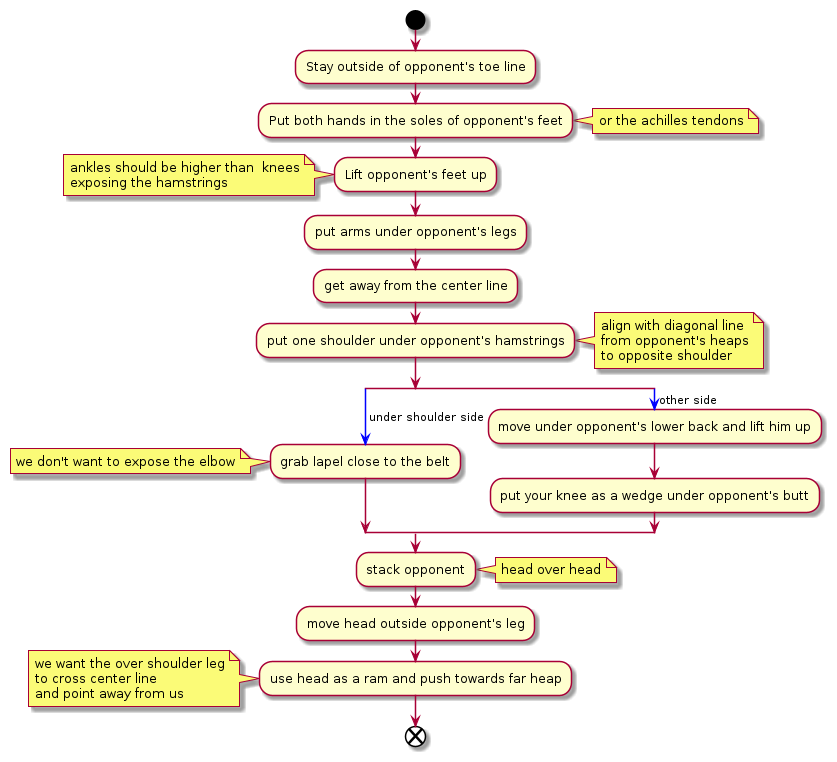

# Double under

Core idea is to put your arms, under opponent's hamstrings, so that you limit
the number of possible attacks, while working on your pass

# Visualizaiton

From [Keenan Cornelius Online](https://keenanonline.com/):

