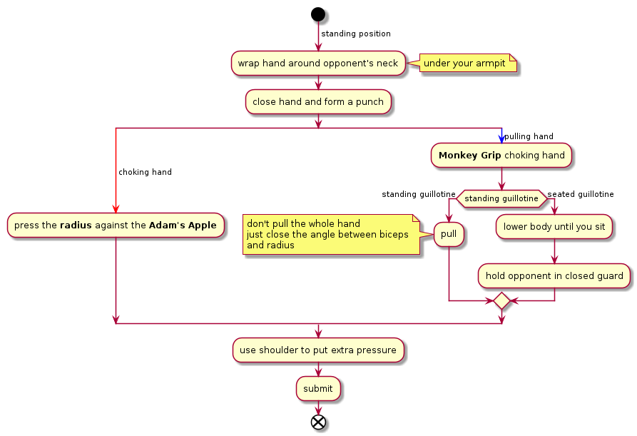

# Guillotine

## Attacking

### From standing

- Wrap hand around uke's neck (under your armpit)
- Close hand and form a punch
- Hard part of wrist should be pressed to adams apple
- The other hand should hold the "punch"
- Without moving shoulder just close the elbow angle (raise wrist, keep eblow and shoulder steady
- Use the other hand to pull the "punch" so that it presses opponents neck.

### From standing to ground
- Start as above, but instead of pulling the "punch"...
- Lower the whole body until you sit in the ground.
- Hold opponent in closed guard

## Defending

- Chin down (close the space to the neck)
- With one hand pull opponent hands away from the neck
- Lower body
- Move free hand under opponents thighs
- Lift opponent and throw him down
- Move to side control (caution: avoid entering half guard)

### Special cases

When in [closed guard](./closed-guard.md) or in [half guard](./hald-guard.md), you can go for [Von flue](./von-flue.md)
