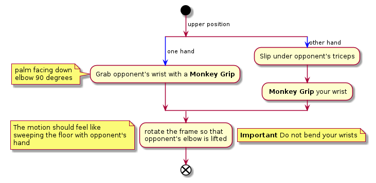

# Kimura

## Attacking

Hold opponents wrist with a [Mokey-Grip](./monkey-grip.md) so that the elbow's bent in a 90 degree
angle and the palm is facing upwards. Slip the other hand under the opponents
triceps and [Mokey-Grip](./monkey-grip.md) the other hand.

Change the angle on opponents elbow so that it gets closer to its ribs.

Lift the hand that acts as a lever under the opponent's triceps, so that the
elbow's lifted.

## Defending
