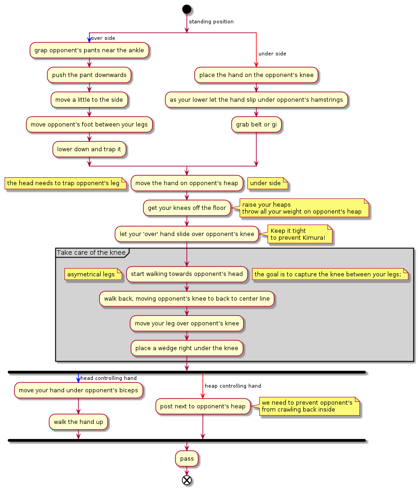

# Over under

The overall idea is that we pass one hand over and one hand under opponent's
feet. We control the feet and we aim straighten one of the knees (over) so we can
easily pass over it.

# Visualizaiton

From [Bernardo Faria](https://bjjfanatics.com/blogs/fighters/bernardo-faria): 

## Additional resources

- John Danaher - [Go Further Faster - Open Guard](https://bjjfanatics.com/products/open-guard-bjj-fundamentals-go-further-faster-by-john-danaher) - Chapter 3 - 29:00
- Benrado Faira - [The Pressure Passing System](https://bjjfanatics.com/products/pressure-passing-encyclopedia-by-bernardo-faria-1) - Chapter 1 - 00:00

