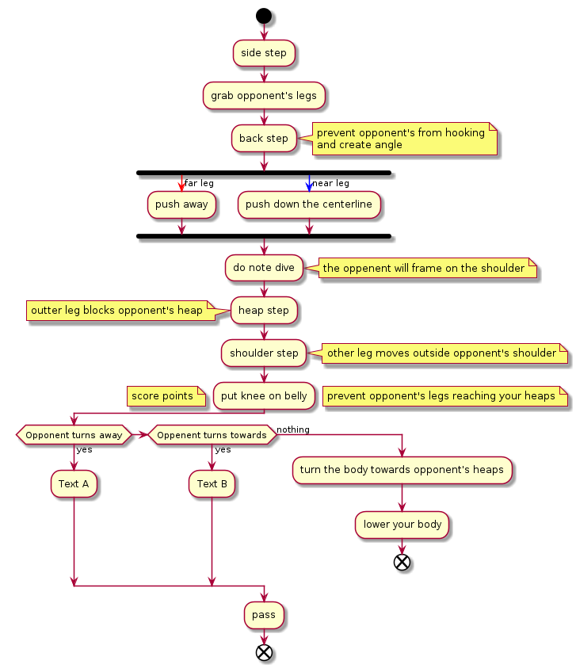

# Toreando

Toreando is characterized by the perpendicular push of opponent's legs.
The far leg is push in line with the heaps (away from the centerline) & the near leg is pushed parallel
to the centerline.

