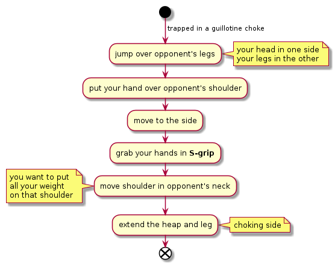

# Von flue

The Von Flue is a choke that can be applied as a defense to a seating guillotine.
The basic idea is that instead of fighting the choke, you try to pass the
opponents guard.

- Jump over opponents legs so that your head is in one side and your legs
  on the opposite side of his body.
- Put one hand over opponents shoulder (choose the hand that does the lifting, not the "punch" one)
- Try to move to the side as much as possible
- Grab your hands in an S-grip
- Move shoulder in opponents neck
- Extend the heap and leg that is in the side of the choking shoulder and
  drop all weight on the shoulder.
- Use head to push opponents arm closer to the neck and complete the choke.

